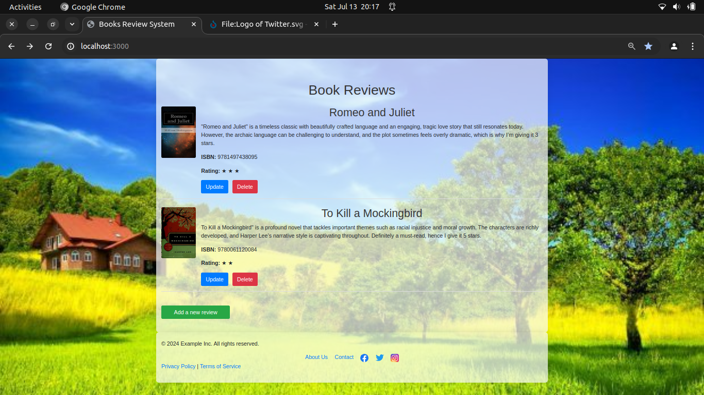

# Book Review System

An open-source book review system built with Express, Axios, EJS, PostgreSQL, and Bootstrap. This project allows users to add, update, and delete book reviews, fetch book covers from the Open Library API, and sort reviews by rating stars from 1-5 and recency.

## Features

- Fetch book covers using the Open Library Covers API.
- Add, update, and delete book reviews.
- Store book reviews in a PostgreSQL database.
- Display reviews with book name, covers, ratings, and ISBN.
- Sort reviews by rating and recency.
- Responsive design using Bootstrap.

## Screenshots

 
_Index page_
<br><br><br><br><br>
 
_Add page_
<br><br><br><br><br>
 
_Update page_
<br><br><br><br><br>

## Installation

1. Clone the repository:
    ```sh
    git clone https://github.com/kailashnirola/movie_review_system.git
    ```
2. Navigate to the project directory:
    ```sh
    cd movie_review_system
    ```

3. Install the dependencies:
    ```sh
    npm install
    ```

4. Set up the PostgreSQL database:
    ```sh
    psql -U postgres
    CREATE DATABASE "book reviews";
    \c "book reviews"
    \i schema.sql
    ```

5. Update the database configuration in the project:
    ```javascript
    const db = new pg.Client({
        user: 'postgres',
        database: 'book reviews',
        host: 'localhost',
        password: 'password',
        port: 5432
    });
    ```

## Usage

1. Start the server:
    ```sh
    npm start
    ```

2. Open your browser and go to `http://localhost:3000` to view the site.

## Technologies Used

- [Express](https://expressjs.com/) - Web framework for Node.js
- [EJS](https://ejs.co/) - Embedded JavaScript templates
- [PostgreSQL](https://www.postgresql.org/) - Relational database management system
- [pg](https://node-postgres.com/) - PostgreSQL client for Node.js
- [Axios](https://axios-http.com/) - Promise-based HTTP client for the browser and Node.js
- [Bootstrap](https://getbootstrap.com/) - CSS framework for responsive design

## Contributing

Contributions are welcome! Please fork the repository and submit a pull request.

## License

This project is licensed under the MIT License. See the [LICENSE](LICENSE) file for details.

## Contact

For any questions or suggestions, please contact me at [b220017@nitsikkim.ac.in](mailto:b220017@nitsikkim.ac.in).

## Follow Us

- [Facebook](https://facebook.com)
- [Twitter](https://twitter.com)
- [Instagram](https://instagram.com)

## Database Schema

To set up the database schema, you can use the following SQL script:

```sql
DROP TABLE IF EXISTS reviews;

CREATE TABLE reviews (
    id SERIAL PRIMARY KEY,
    name TEXT NOT NULL,
    review TEXT,
    isbn BIGINT UNIQUE NOT NULL,
    stars INTEGER
);
```

Example
```sql
INSERT INTO reviews (name, isbn, stars, review) VALUES 
('Romeo and Juliet', 9781497438095, 4, '"Romeo and Juliet" is a timeless classic with beautifully crafted language and an engaging, tragic love story that still resonates today. However, the archaic language can be challenging to understand, and the plot sometimes feels overly dramatic, which is why I’m giving it 4 stars.');
```